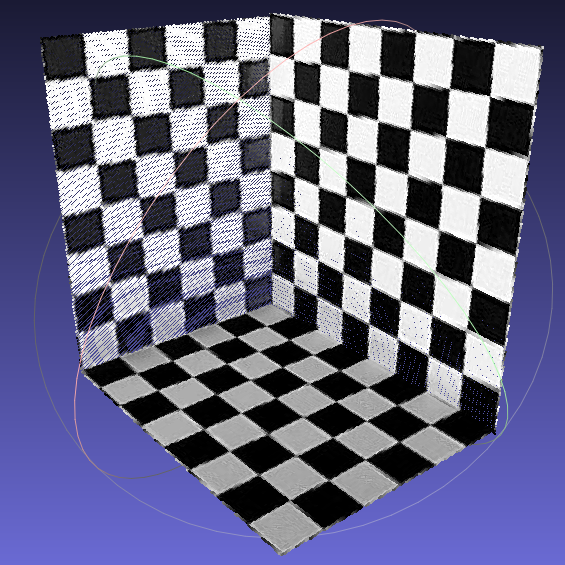

# 3D Reconstruction Using Vanishing Points From a Single View

###### Tips: If the math formula can't be displayed, you may need a Google extension: [MathJax Plugin for Github](https://www.crx4chrome.com/crx/72309/).

****

### Preprocess

#### choose a simple image which contains 3 mutually vertical planes, and use a simple annotation tool (LABEL ME) to annotate the image.

* annotate several parallel lines in the world on each vertical plane (make sure lines of each plane are vertical to each other). 

* annotate other parallel lines which are not parallel to above lines (make sure lines of each plane are vertical to each other).

* annotate the common point of plane intersection lines.

* annotate regions where 3D points will be displayed.

****

### Code

#### 1. load LABEL ME json data, and get parallel lines, common point of plane intersection lines, and masks of vertical planes

#### 2. according to intersection points in the image coordinate system of parallel lines, calculate points and lines at infinity from labeled parallel lines

#### 3. according to three vanishing points (points at infinity) from mutually orthogonal lines, calculate camera matrix

$$ cos\theta = \frac {v_1^T \omega v_2^T} {\sqrt {v_1^T \omega v_1^T} \sqrt {v_2^T \omega v_2^T}} $$

when $ \theta = 90^\circ $, 

$$ v_1^T \omega v_1^T=0 , \omega = (KK^T)^{-1} $$

#### 4. according to lines at infinity of 3 vertical planes and camera matrix, calculate scene plane orientations (normal vectors)

$$ n=K^Tl_{horiz} $$

#### 5. substitute the common point(suppose projective depth λ=1) of plane intersection lines into plane equations, to calculate distance between each plane and camera center

$$ \tilde X = \tbinom {\frac {\lambda K^{-1} x} {\left\| K^{-1} x \right\|}} {1} $$

$$ \Big( \frac {\lambda K^{-1} l} {\left\| K^{-1} l \right\|} \Big)^T X + d = 0 $$

#### 6. substitute 2D points into corresponding plane equation, to calculate 3D positions for masked image (up to a unknown scale) and then, save as ply file

    

# 利用隐消点实现单视图三维重构

###### Tips: 如果下述公式无法正常显示，你可能需要Google扩展程序：[MathJax Plugin for Github](https://www.crx4chrome.com/crx/72309/).

****

### 预处理

#### 选择一张“在真实场景中有三个相互垂直的平面”的图像，使用标注工具 LABEL ME 对该图像进行标注：（下述“垂直”/“平行”皆是指在真实世界中垂直/平行）

* 在每个垂直面上标出若干条平行线，并确保三个平面上的平行线相互垂直

* 同上，再次在三个平面上标注相互垂直的平行线，并与上一步所标注的的平行线方向不同（示例图为垂直）

* 标出平面交线的公共点

* 标出最终进行三维重建效果展示的区域（掩模）

****

### 代码

#### 1. 加载使用 LABEL ME 工具标注产生的json数据, 得到标记的平行线、平面交点、垂直面掩模；

#### 2. 根据所标记的平行线在图像上的交点（通过计算得到），估算隐消点和场景中各个平面的隐消线；

#### 3. 根据由三组正交平行线得到的影消点，计算摄像机内参数矩阵（标定）；

$$ cos\theta = \frac {v_1^T \omega v_2^T} {\sqrt {v_1^T \omega v_1^T} \sqrt {v_2^T \omega v_2^T}} $$

when $ \theta = 90^\circ $, 

$$ v_1^T \omega v_1^T=0 , \omega = (KK^T)^{-1} $$

#### 4. 根据三个垂直面对应的隐消线和摄像机矩阵，计算场景平面的法方向（法向量）；

$$ n=K^Tl_{horiz} $$

#### 5. 将平面交线的公共点代入具未知参数d的平面方程（设深度λ=1)，计算出各个场景平面到摄像机中心的距离d；

$$ \tilde X = \tbinom {\frac {\lambda K^{-1} x} {\left\| K^{-1} x \right\|}} {1} $$

$$ \Big( \frac {\lambda K^{-1} l} {\left\| K^{-1} l \right\|} \Big)^T X + d = 0 $$

#### 6. 将掩模区域中所有2D点坐标代入各点对应的场景平面方程（已知d），计算出3D坐标，保存为ply文件，即单视图重建完成。

    

